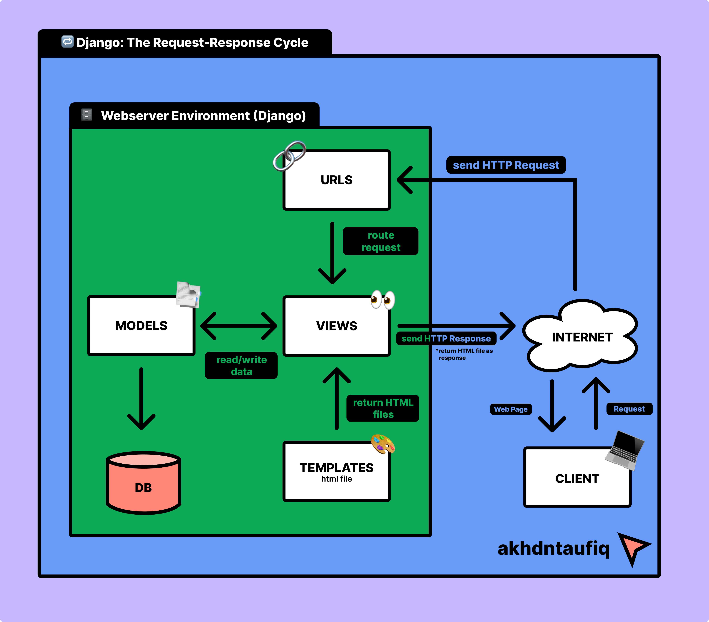

# Co-Hand (Crafted Original by Hand)
### <i>Your Online Handmade Shop🛍️</i>
###### by Akhdan Taufiq Syofyan | PBP-D | 2306152475
##### 🔗WEB LINK : http://akhdan-taufiq-cohand.pbp.cs.ui.ac.id/
#### Table of Contents
- [Jawaban Tugas 2: Implementasi Model-View-Template (MVT) pada Django](https://github.com/akhdntaufiq/co-hand?tab=readme-ov-file#jawaban-tugas-2) <br>
- [Jawaban Tugas 3: Implementasi Form dan Data Delivery pada Django](https://github.com/akhdntaufiq/co-hand?tab=readme-ov-file#jawaban-tugas-3)
## 🖋Jawaban Tugas 2
### 1️⃣ Jelaskan bagaimana cara kamu mengimplementasikan checklist di atas secara step-by-step!
1. Membuat direktori lokal dengan nama "co-hand" untuk proyek git, lalu konfigurasi git pada direktori tersebut.
   ```
   git init
   git config --global user.name "<NAME>"
   git config --global user.email "<EMAIL>"
   ```
2. Kemudian, saya membuat repositori di github dengan nama "co-hand".
3. Setelah direktori lokal dan repositori github dibuat, saya akan menghubungkan keduanya dengan cara melakukan hal berikut di terminal direktori lokal. **(NOTES: default branch saya adalah master)**
   ```
   git branch -M master
   git remote add origin <URL REPO>
   ```
4. Untuk mengecek apakah sudah atau belumnya terhubung, saya membuat file `README.md` di direktori lokal. Lalu, saya menjalankan command berikut di dalam terminal direktori lokal.
   ```
   git add .
   git commit -m "update...."
   git push origin master
   ```
5. Setelah melakukan perintah tersebut, file `README.md` seharusnya sudah berada di dalam repositori github "co-hand".
6. Kemudian, saya lanjut mengenai instalasi django. hal pertama yang dolakukan adalah membuat virtual environment di dalam direktori lokal dan mengaktifkannya dengan cara berikut. **(NOTES: Saya menggunakan Windows)**
   ```
   python -m venv env
   env\Scripts\activate
   ```
7. Pada direkori lokal "co-hand", saya membuat file `requirements.txt` dan menambahkan beberapa dependencies.
8. Lalu, install dependencies tersebut dan dilanjutkan dengan membuat proyek django dengan nama "co_hand".
   ```
   pip install -r requirements.txt
   django-admin startproject co_hand .
   ```
9. Setelah menjalankan langkah diatas, saya melihat terdapat beberapa file serta folder baru. Kemudian, saya mencari `settings.py` dan menambahkan kedua string berikut ke dalam `ALLOWED_HOST`.
    ```
    "localhost", "127.0.0.1"
    ```
10. Kemudian, saya membuat aplikasi baru dengan nama `main`.</p>
    ```
    python manage.py startapp main
    ```
11. Setelah itu saya menambahkan `main` pada `INSTALLED_APPS` di `settings.py` direktori co_hand.
12. Kemudian, saya membuat direktori baru di aplikasi main dengan nama `templates` dan membuat file baru di dalamnya dengan nama `main.html`. Lalu, saya mengisi `main.html` dengan kode berikut.
    ```
    <!DOCTYPE html>
    <html lang="en">
    <head>
        <meta charset="UTF-8">
        <meta name="viewport" content="width=device-width, initial-scale=1.0">
        <title></title>
    </head>
    <body>
        <h1>Welcome to {{app}}</h1>
        <h5><i>"Karya Tangan, Penuh Makna"</i></h5>
        <p>Made with 💖 by {{name}} | {{class}} | {{npm}}</p>
    </body>
    </html>
    ```
13. Lalu, saya mengisi `models.py` pada aplikasi main dengan kode berikut.
    ```
    from django.db import models

    class Product(models.Model):
        name = models.CharField(max_length=255)
        price = models.IntegerField()
        description = models.TextField()
        date_added = models.DateTimeField(auto_now_add=True)
    
        def __str__(self):
            return self.name
    ```
14. Karena pada project ini saya menggunakan models, maka saya harus mengaplikasikan models ke dalam basis data dengan cara migrasi model.
    ```
    python manage.py makemigrations
    python manage.py migrate
    ```
15. Kemudian, saya menghubungkan view dengan template yang sebelumnya sudah dibuat dengan cara menambahkan line berikut pada `views.py` di dalam aplikasi main.
    ```
    from django.shortcuts import render

    def show_main(request):
    context = {
        'app' : 'Co-Hand',
        'name': 'Akhdan Taufiq',
        'class': 'PBP D',
        'npm' : '2306152475',
    }

    return render(request, "main.html", context)
    ```
16. Setelah menguhubungkan views dan templates, saya mengonfigurasi routing URL dengan cara mengisi berkas `urls.py` pada direktori luar dengan kode berikut.
    ```
    from django.contrib import admin
    from django.urls import path, include
    
    urlpatterns = [
        path('admin/', admin.site.urls),
        path('', include('main.urls')),
    ]
    ```
17. Kemudian, saya menambahkan berkas `.gitigoner` untuk menentukan apa saja berkas yang perlu diabaikan git.
18. Langkah berikutnya yang saya lakukan adalah membuat akun pada PWS yang nantinya akan digunakan untuk men-deploy project django yang dibuat.
19. Lalu, saya membuat project baru pada PWS dan mendapatkan Project Credentials dan Project Command.
20. Kemudian, saya kembali ke `settings.py` dan menambahkan url deployment pada list `ALLOWED_HOST`.
    ```
    ALLOWED_HOSTS = ["localhost", "127.0.0.1", "akhdan-taufiq-cohand.pbp.cs.ui.ac.id"]
    ```
21. Setelah semua langkah project django (selain deployment) dan pembuatan project PWS selesai, saya melakukan push ke dalam repo github dengan melakukan command berikut pada direktori lokal.
    ```
    git add .
    git commit -m "finish...."
    git push origin master
    ```
22. Langkah akhir yang saya lakukan adalah menjalankan command berikut.
    ```
    git remote add pws http://pbp.cs.ui.ac.id/akhdan.taufiq/cohand
    git branch -M master
    git push pws master
    ```
23. Jika saya suatu saat ingin memperbarui web tersebut, maka saya dapat menjalankan command berikut pada terminal direktori lokal co-hand.
    ```
    git branch -M main
    git push pws main:master
    ```
24. Dengan mengikuti langkah-langkah diatas, maka deployment project django saya pun selesai.
---

### 2️⃣ Buatlah bagan yang berisi request client ke web aplikasi berbasis Django beserta responnya dan jelaskan pada bagan tersebut kaitan antara urls.py, views.py, models.py, dan berkas html!


---


### 3️⃣ Jelaskan fungsi git dalam pengembangan perangkat lunak!
Git dalam pengembangan perangkat lunak sangat menguntungkan developer karena membantu melacak perubahan kode, menggabungkan (merge) perubahan, membuat percabangan (branch) untuk penambahan fitur, atau bahkan memungkinkan untuk kembali ke versi sebelumnya jika diperlukan. Hal ini saat dibutuhkan dalam sebuah project yang memerlukan kolaborasi banyak developer dalam satu waktu sehingga meningkatkan efisiensi waktu.

---


### 4️⃣ Mengapa framework Django dijadikan permulaan pembelajaran pengembangan perangkat lunak?
Framework Django seringkali dijadikan permulaan pembelajaran dikarenakan menggunakan bahasa Python yang mudah dipahami sehingga membuat pemula dapat lebih fokus dalam pemrograman web. Selain itu, arsitektur MVT (Model-View-Template) pada Django yang membuat struktur aplikasi yang terorganisir, ekosistem yang matang, serta dokumentasi yang jelas membuat Django menjadi salah satu pilihan yang tepat untuk permulaan pembelajaran *software development*.

---

### 5️⃣ Mengapa model pada Django disebut sebagai ORM?
Model Django disebut ORM (Object-Relational Mapping) karena menghubungi objek Python dengan database relasional. ORM memungkinkan developer berinteraksi dengan database menggunakan kode Python, tanpa perlu menulis/menggunakan SQL secara langsung.

## 🖋Jawaban Tugas 3
 ### 1️⃣ Jelaskan mengapa kita memerlukan data delivery dalam pengimplementasian sebuah platform?
 ---
 ### 2️⃣ Menurutmu, mana yang lebih baik antara XML dan JSON? Mengapa JSON lebih populer dibandingkan XML?
 ---
 ### 3️⃣ Jelaskan fungsi dari method is_valid() pada form Django dan mengapa kita membutuhkan method tersebut?
 ---
 ### 4️⃣ Mengapa kita membutuhkan csrf_token saat membuat form di Django? Apa yang dapat terjadi jika kita tidak menambahkan csrf_token pada form Django? Bagaimana hal tersebut dapat dimanfaatkan oleh penyerang?
 ---
 ### 5️⃣ Jelaskan bagaimana cara kamu mengimplementasikan checklist di atas secara step-by-step (bukan hanya sekadar mengikuti tutorial).
 ---
