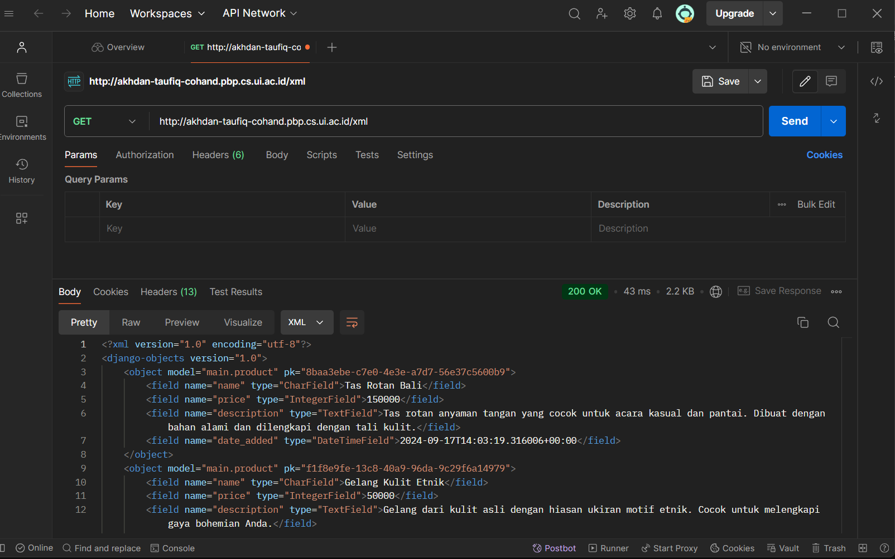
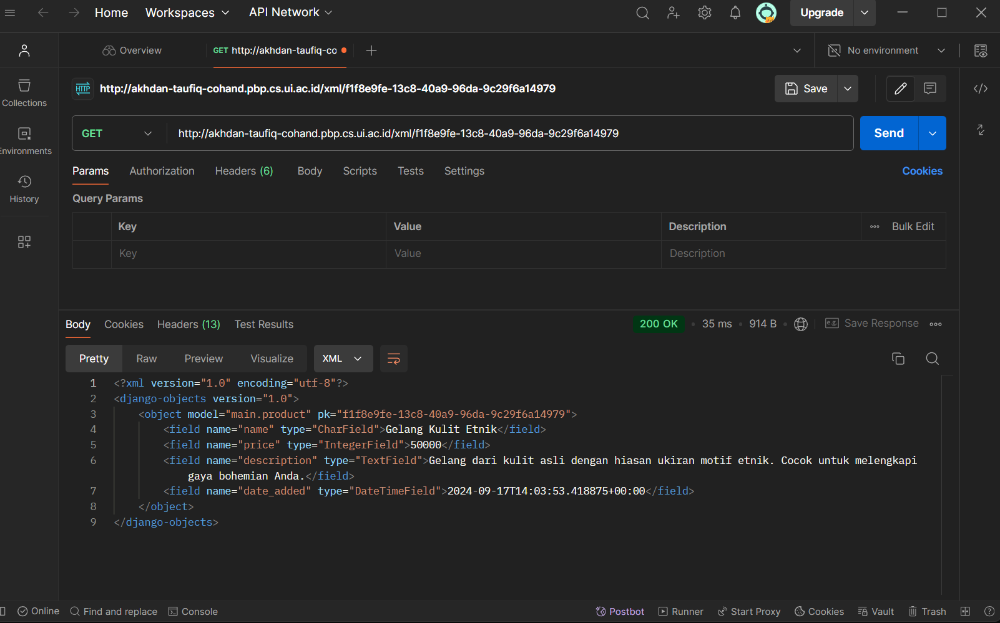
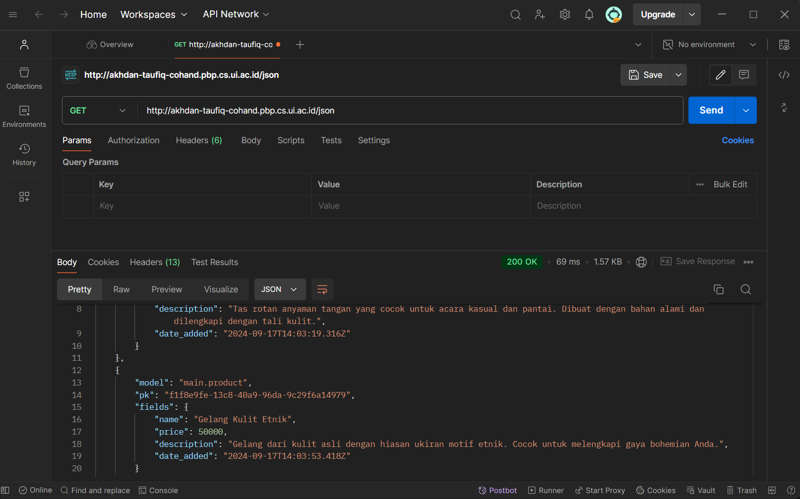
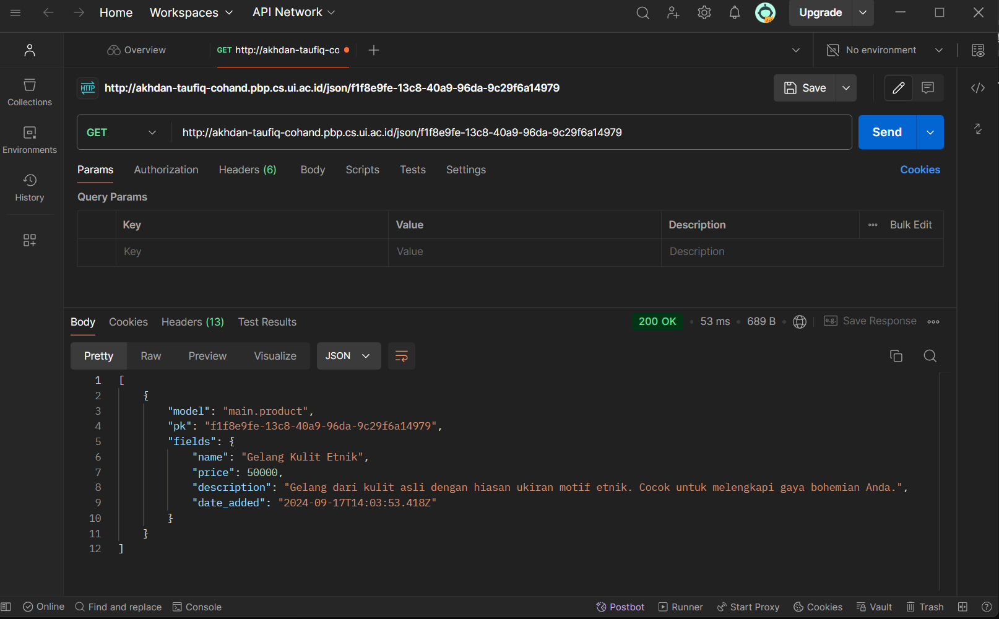
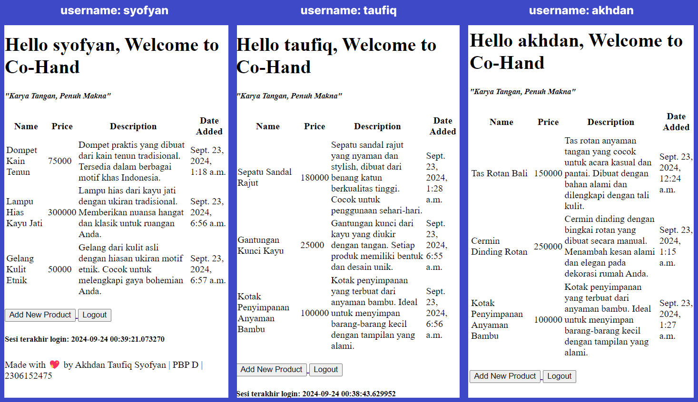

# Co-Hand (Crafted Original by Hand)
### <i>Your Online Handmade Shop🛍️</i>
###### by Akhdan Taufiq Syofyan | PBP-D | 2306152475
##### 🔗WEB LINK : http://akhdan-taufiq-cohand.pbp.cs.ui.ac.id/

<details>
<summary><b>🖋Tugas 2</b></summary>

#### 1️⃣ Jelaskan bagaimana cara kamu mengimplementasikan checklist di atas secara step-by-step!
1. Membuat direktori lokal dengan nama "co-hand" untuk proyek git, lalu konfigurasi git pada direktori tersebut.
   ```
   git init
   git config --global user.name "<NAME>"
   git config --global user.email "<EMAIL>"
   ```
2. Kemudian, saya membuat repositori di github dengan nama "co-hand".
3. Setelah direktori lokal dan repositori github dibuat, saya akan menghubungkan keduanya dengan cara melakukan hal berikut di terminal direktori lokal. **(NOTES: default branch saya adalah master)**
   ```
   git branch -M master
   git remote add origin <URL REPO>
   ```
4. Untuk mengecek apakah sudah atau belumnya terhubung, saya membuat file `README.md` di direktori lokal. Lalu, saya menjalankan command berikut di dalam terminal direktori lokal.
   ```
   git add .
   git commit -m "update...."
   git push origin master
   ```
5. Setelah melakukan perintah tersebut, file `README.md` seharusnya sudah berada di dalam repositori github "co-hand".
6. Kemudian, saya lanjut mengenai instalasi django. hal pertama yang dolakukan adalah membuat virtual environment di dalam direktori lokal dan mengaktifkannya dengan cara berikut. **(NOTES: Saya menggunakan Windows)**
   ```
   python -m venv env
   env\Scripts\activate
   ```
7. Pada direkori lokal "co-hand", saya membuat file `requirements.txt` dan menambahkan beberapa dependencies.
8. Lalu, install dependencies tersebut dan dilanjutkan dengan membuat proyek django dengan nama "co_hand".
   ```
   pip install -r requirements.txt
   django-admin startproject co_hand .
   ```
9. Setelah menjalankan langkah diatas, saya melihat terdapat beberapa file serta folder baru. Kemudian, saya mencari `settings.py` dan menambahkan kedua string berikut ke dalam `ALLOWED_HOST`.
    ```
    "localhost", "127.0.0.1"
    ```
10. Kemudian, saya membuat aplikasi baru dengan nama `main`.</p>
    ```
    python manage.py startapp main
    ```
11. Setelah itu saya menambahkan `main` pada `INSTALLED_APPS` di `settings.py` direktori co_hand.
12. Kemudian, saya membuat direktori baru di aplikasi main dengan nama `templates` dan membuat file baru di dalamnya dengan nama `main.html`. Lalu, saya mengisi `main.html` dengan kode berikut.
    ```
    <!DOCTYPE html>
    <html lang="en">
    <head>
        <meta charset="UTF-8">
        <meta name="viewport" content="width=device-width, initial-scale=1.0">
        <title></title>
    </head>
    <body>
        <h1>Welcome to {{app}}</h1>
        <h5><i>"Karya Tangan, Penuh Makna"</i></h5>
        <p>Made with 💖 by {{name}} | {{class}} | {{npm}}</p>
    </body>
    </html>
    ```
13. Lalu, saya mengisi `models.py` pada aplikasi main dengan kode berikut.
    ```
    from django.db import models

    class Product(models.Model):
        name = models.CharField(max_length=255)
        price = models.IntegerField()
        description = models.TextField()
        date_added = models.DateTimeField(auto_now_add=True)
    
        def __str__(self):
            return self.name
    ```
14. Karena pada project ini saya menggunakan models, maka saya harus mengaplikasikan models ke dalam basis data dengan cara migrasi model.
    ```
    python manage.py makemigrations
    python manage.py migrate
    ```
15. Kemudian, saya menghubungkan view dengan template yang sebelumnya sudah dibuat dengan cara menambahkan line berikut pada `views.py` di dalam aplikasi main.
    ```
    from django.shortcuts import render

    def show_main(request):
    context = {
        'app' : 'Co-Hand',
        'name': 'Akhdan Taufiq',
        'class': 'PBP D',
        'npm' : '2306152475',
    }

    return render(request, "main.html", context)
    ```
16. Setelah menguhubungkan views dan templates, saya mengonfigurasi routing URL dengan cara mengisi berkas `urls.py` pada direktori luar dengan kode berikut.
    ```
    from django.contrib import admin
    from django.urls import path, include
    
    urlpatterns = [
        path('admin/', admin.site.urls),
        path('', include('main.urls')),
    ]
    ```
17. Kemudian, saya menambahkan berkas `.gitigoner` untuk menentukan apa saja berkas yang perlu diabaikan git.
18. Langkah berikutnya yang saya lakukan adalah membuat akun pada PWS yang nantinya akan digunakan untuk men-deploy project django yang dibuat.
19. Lalu, saya membuat project baru pada PWS dan mendapatkan Project Credentials dan Project Command.
20. Kemudian, saya kembali ke `settings.py` dan menambahkan url deployment pada list `ALLOWED_HOST`.
    ```
    ALLOWED_HOSTS = ["localhost", "127.0.0.1", "akhdan-taufiq-cohand.pbp.cs.ui.ac.id"]
    ```
21. Setelah semua langkah project django (selain deployment) dan pembuatan project PWS selesai, saya melakukan push ke dalam repo github dengan melakukan command berikut pada direktori lokal.
    ```
    git add .
    git commit -m "finish...."
    git push origin master
    ```
22. Langkah akhir yang saya lakukan adalah menjalankan command berikut.
    ```
    git remote add pws http://pbp.cs.ui.ac.id/akhdan.taufiq/cohand
    git branch -M master
    git push pws master
    ```
23. Jika saya suatu saat ingin memperbarui web tersebut, maka saya dapat menjalankan command berikut pada terminal direktori lokal co-hand.
    ```
    git branch -M main
    git push pws main:master
    ```
24. Dengan mengikuti langkah-langkah diatas, maka deployment project django saya pun selesai.
---

#### 2️⃣ Buatlah bagan yang berisi request client ke web aplikasi berbasis Django beserta responnya dan jelaskan pada bagan tersebut kaitan antara urls.py, views.py, models.py, dan berkas html!


---


#### 3️⃣ Jelaskan fungsi git dalam pengembangan perangkat lunak!
Git dalam pengembangan perangkat lunak sangat menguntungkan developer karena membantu melacak perubahan kode, menggabungkan (merge) perubahan, membuat percabangan (branch) untuk penambahan fitur, atau bahkan memungkinkan untuk kembali ke versi sebelumnya jika diperlukan. Hal ini saat dibutuhkan dalam sebuah project yang memerlukan kolaborasi banyak developer dalam satu waktu sehingga meningkatkan efisiensi waktu.

---


#### 4️⃣ Mengapa framework Django dijadikan permulaan pembelajaran pengembangan perangkat lunak?
Framework Django seringkali dijadikan permulaan pembelajaran dikarenakan menggunakan bahasa Python yang mudah dipahami sehingga membuat pemula dapat lebih fokus dalam pemrograman web. Selain itu, arsitektur MVT (Model-View-Template) pada Django yang membuat struktur aplikasi yang terorganisir, ekosistem yang matang, serta dokumentasi yang jelas membuat Django menjadi salah satu pilihan yang tepat untuk permulaan pembelajaran *software development*.

---

#### 5️⃣ Mengapa model pada Django disebut sebagai ORM?
Model Django disebut ORM (Object-Relational Mapping) karena menghubungi objek Python dengan database relasional. ORM memungkinkan developer berinteraksi dengan database menggunakan kode Python, tanpa perlu menulis/menggunakan SQL secara langsung.

</details>
<details>
<summary><b>🖋Tugas 3</b></summary>

 #### 1️⃣ Jelaskan mengapa kita memerlukan data delivery dalam pengimplementasian sebuah platform?
Data Delivery sangat penting dalam pengimplementasian sebuah platform. Mekanisme ini penting karena memungkinkan transfer informasi yang lebih akurat dan efisien antara user, sistem, dan juga device. Tanpa implementasi dari data delivery ini, platform tidak dapat berjalan secara maksimal dan memberikan hasil yang diharapkan.

---
 #### 2️⃣ Menurutmu, mana yang lebih baik antara XML dan JSON? Mengapa JSON lebih populer dibandingkan XML?
Menurut saya, JSON (JavaScript Object Notation) lebih baik dibanding XML (eXtensible Markup Language) karena formatnya yang lebih mudah dibaca, yaitu {key:value} seperti data type dictionary pada python. Selain readability yang baik, kinerja parsing JSON juga lebih cepat dikarenakan struktur data yang sederhana serta bisa diubah menjadi objek di JavaScript tanpa memerlukan banyak langkah tambahan. Berbanding terbalik dengan XML yang memerlukan langkah lebih banyak dikarenakan adanya tag dan atribut yang kompleks. Dengan berbagai kemudahan yang diberikan oleh JSON, membuat JSON lebih populer dibandingkan XML.

---
 #### 3️⃣ Jelaskan fungsi dari method is_valid() pada form Django dan mengapa kita membutuhkan method tersebut?
*Method* `is_valid()` pada *form* Django memiliki peran penting dalam aspek integritas dan validasi data. Secara garis besar, method ini akan melakukan validasi menyeluruh terhadap setiap *field*. Jika terdapat kesalahan dalam proses ini, *method* ini akan me-*return* nilai *False*. Namun, jika semua validasi berhasil dilewati, maka *method* akan melakukan validasi data ke dalam atribut `cleaned_data` dari *form* dan me-*return* nilai *True*.

 ---
 #### 4️⃣ Mengapa kita membutuhkan csrf_token saat membuat form di Django? Apa yang dapat terjadi jika kita tidak menambahkan csrf_token pada form Django? Bagaimana hal tersebut dapat dimanfaatkan oleh penyerang?
`csrf_token` pada Django dibutuhkan untuk melindungi web dari serangan Cross-Site Request Forgery (CSRF). Jika kita tidak menyertakan CSRF token dalam form Django, maka permintaan POST bisa berasal dari site yang tidak sah, atau bahkan bisa saja berbahaya. Pada implementasinya, Django akan menyisipkan token ke dalam form HTML menggunakan tag template dimana tag ini akan menghasilkan input tersembunyi dengan nilai token yang unik. Token yang di-generate ini akan selalu disertakan dalam data request sehingga di saat ada permintaan POST dari form, token akan diekstrak dan dibandingkan dengan token yang disimpan di session user. Berbagai proses ini jika dilewatkan, akan memudahkan penyerang karena dapat melakukan POST request ke server tanpa sepengetahuan user.

 ---
 #### 5️⃣ Jelaskan bagaimana cara kamu mengimplementasikan checklist di atas secara step-by-step (bukan hanya sekadar mengikuti tutorial).
 - **Membuat input form untuk menambahkan objek model pada app sebelumnya.**
   1. Membuat berkas `forms.py ` pada direktori main.
      ```
      from django.forms import ModelForm
      from main.models import Product

      class ProductEntryForm(ModelForm):
         class Meta:
            model = Product
            fields = ["name", "price", "description"]
      ```
   2. Menambahkan import redirect pada `views.py ` agar setelah user mengisi form langsung balik ke halaman utama serta menambahkan method untuk membuat produk.
      ```
      from django.shortcuts import render, redirect
      ```
      ```
      def create_product(request):
         form = ProductEntryForm(request.POST or None)

         if form.is_valid() and request.method == "POST":
            form.save()
            return redirect('main:show_main')

         context = {'form': form}
         return render(request, "create_product.html", context)
      ```
   3. Menambahkan line berikut pada funngsi `show_main` pada `views.py` untuk mengambil seluruh produk yang di tersimpan dalam database. (data dalam database berasal dari input form)
      ```
      def show_main(request):
         products = Product.objects.all()
         context = {
            'app' : 'Co-Hand',
            'name': 'Akhdan Taufiq',
            ' class': 'PBP D',
            'npm' : '2306152475',
            'products' : products,
         }

         return render(request, "main.html", context)
      ```
   4. Menambahkan path url menuju page pengisian form
      ```
      from django.urls import path
      from main.views import show_main, create_product

      app_name = 'main'

      urlpatterns = [
         path('', show_main, name='show_main'),
         path('create-product', create_product, name='create_product'),
      ]
      ```
   5. Membuat file HTML baru didalam `main/templates` dengan nama `create_product.html` sebagai halaman form dimana object product dibuat. (NOTES: Jangan lupa untuk memasukan 
      ```
       
      
      <h1>Add Your Product</h1>
      
      <form method="POST">
        
        <table>
          {{ form.as_table }}
          <tr>
            <td></td>
            <td>
              <input type="submit" value="Add Product" />
            </td>
          </tr>
        </table>
      </form>
      
      
      ```
 - **Tambahkan 4 fungsi views baru untuk melihat objek yang sudah ditambahkan dalam format XML, JSON, XML by ID, dan JSON by ID.**
   1. Menambahkan import `HttpResponse` dan  `Serializer` pada `views.py` pada direktori `main`
      ```
      from django.http import HttpResponse
      from django.core import serializers
      ```
   2. Membuat fungsi berikut di dalam `views.py` pada direktori `main`
      ```
      def show_xml(request):
         data = Product.objects.all()
         return HttpResponse(serializers.serialize("xml", data), content_type="application/xml")

      def show_json(request):
         data = Product.objects.all()
         return HttpResponse(serializers.serialize("json", data), content_type="application/json")

      def show_xml_by_id(request, id):
         data = Product.objects.filter(pk=id)
         return HttpResponse(serializers.serialize("xml", data), content_type="application/xml")

      def show_json_by_id(request, id):
         data = Product.objects.filter(pk=id)
         return HttpResponse(serializers.serialize("json", data), content_type="application/json")
      ```
 - **Membuat routing URL untuk masing-masing views yang telah ditambahkan pada poin 2.**
   1. Meng-import fungsi yang dibuat dalam `views.py` ke dalam `urls.py` di dalam direktori `main`
      ```
      from main.views import show_main, create_product, show_xml, show_json,show_json_by_id,show_xml_by_id
      ```
   2. Manambahkan path URL ke dalam urlpatterns untuk mengakses setiap fungsi yang sudah di import sebelumnya
      ```
      urlpatterns = [
          ...
          path('xml/', show_xml, name='show_xml'),
          path('json/' , show_json, name='show_json'),
          path('xml/<str:id>/', show_xml_by_id, name='show_xml_by_id'),
          path('json/<str:id>/', show_json_by_id, name='show_json_by_id'),
      ]
      ```
 ---
### 6️⃣ Postman Documentation
1. `show_xml`


2. `show_xml_by_id`


3. `show_json`


4. `show_json_by_id`


</details>

<details>
<summary><b>🖋Tugas 4</b></summary>
   
#### 1️⃣ Apa perbedaan antara HttpResponseRedirect() dan redirect()?
`HttpResponseRedirect()` adalah class bawaan Django yang digunakan untuk mengarahkan pengguna ke URL tertentu secara manual dengan membutuhkan URL lengkap atau relatif sebagai parameter. Sebaliknya, `redirect()` adalah fungsi shortcut yang lebih fleksibel karena dapat menerima URL, nama view, ataupun objek sebagai paramaternya, dan secara otomatis mengarahkan pengguna ke lokasi yang tepat. Walaupun demikian, `redirect()` secara internal menggunakan `HttpResponseRedirect()`, yakni `redirect()` akan mengonversi parameter menjadi sebuah URL dan mengembalikan `HttpResponseRedirect()`. Karena itulah keduanya bisa dibilang melakukan hal yang sama, namun `redirect()` lebih fleksibel dalam penggunaannya.

---
#### 2️⃣ Jelaskan cara kerja penghubungan model Product dengan User!
Dalam Django, penghubungan model `Product` dengan model `User` dilakukan menggunakan `ForeignKey`, yang merupakan tipe field yang memungkinkan kita untuk menyimpan referensi ke objek lain, dalam hal ini, pengguna. Ketika kita mendeklarasikan `user = models.ForeignKey(User, on_delete=models.CASCADE)`, kita memastikan bahwa setiap entri prodduct akan memiliki referensi ke pengguna yang membuatnya. Ini menciptakan relasi many-to-one, di mana satu pengguna bisa memiliki banyak entri product.

Contoh implementasi dari hubungan model Product dengan User adalah sebagai berikut:
```
...
class Product(models.Model) :
   user = models.ForeignKey(User, on_delete=models.CASCADE)
   mood = models.CharField(max_length=255)
   time = models.DateField(auto_now_add=True)
   feelings = models.TextField()
   ...   
```
---

#### 3️⃣ Apa perbedaan antara authentication dan authorization, apakah yang dilakukan saat pengguna login? Jelaskan bagaimana Django mengimplementasikan kedua konsep tersebut.
- **Authentication**
   - Authentication adalah proses untuk verifikasi data user. Pada umumnya, user diminta untuk memasukkan kredensial yang layak seperti username dan password
  - Implementasi pada Django:
     Pada Django, proses authentication dilakukan dalam fitur login. Setelah user memasukkan kredensial, Django akan memverifikasi apakah kredensial valid atau tidak.
- **Authorization**
  - Authorization adalah proses penentuan hak akses yang dapat dan tidak dapat dilakukan oleh seorang user dalam aplikasi. Hal ini berkaitan dengan pengaturan akses ke sumber daya tertentu
  - Implementasi pada Django:
     Setelah proses authentication, Django akan memverifikasi izin user untuk menentukan akses mereka ke berbagai bagian aplikasi. Hal ini diatur dengan menggunakan decorator, seperti `@login_required`.

---

#### 4️⃣ Bagaimana Django mengingat pengguna yang telah login? Jelaskan kegunaan lain dari cookies dan apakah semua cookies aman digunakan?
- Django mengingat pengguna yang sudah login dengan menggunakan session yang dikelola melalui cookie. Ketika pengguna login, Django membuat sesi khusus untuk mereka dan menyimpan informasi penting di server. Di sisi pengguna, Django menempatkan session ID dalam cookie di browser. Jadi, setiap kali pengguna mengunjungi halaman lain, browser mengirimkan session ID tersebut ke server, dan Django tahu siapa pengguna tersebut tanpa perlu login lagi.
- Cookies tidak hanya digunakan untuk mengingat sesi pengguna, tetapi juga bisa digunakan untuk menyimpan preferensi atau melacak aktivitas. Namun, tidak semua cookies aman digunakan. Agar terlindungi dari serangan, cookies harus dikonfigurasi dengan benar menggunakan fitur seperti `Secure` untuk memastikan cookie hanya dikirim melalui koneksi HTTPS, `HttpOnly` untuk mencegah akses oleh JavaScript, dan `SameSite` untuk membatasi pengiriman cookie lintas situs yang dapat mengurangi risiko serangan CSRF.

---

#### 5️⃣ Jelaskan bagaimana cara kamu mengimplementasikan checklist di atas secara step-by-step (bukan hanya sekadar mengikuti tutorial)!
- **Implementasi Fungsi Login, Logout, dan Registrasi**
  1. Mengimport library berikut untuk kebutuhan fitur registrasi, login, dan logout pada berkas `views.py` di direktori `main`.
     ```
     from django.contrib import messages
     from django.contrib.auth.forms import UserCreationForm, AuthenticationForm
     from django.contrib.auth import authenticate, login, logout
     ```
  2. Menambahkan fungsi-fungsi berikut pada berkas `views.py` di direktori `main`.
     ```
     def register(request):
        form = UserCreationForm()
        if request.method == "POST":
           form = UserCreationForm(request.POST)
           if form.is_valid():
               form.save()
               messages.success(request, 'Your account has been successfully created!')
               return redirect('main:login')
        context = {'form':form}
        return render(request, 'register.html', context)

      def login_user(request):
         if request.method == 'POST':
            form = AuthenticationForm(data=request.POST)
            if form.is_valid():
               user = form.get_user()
               login(request, user)
               response = HttpResponseRedirect(reverse("main:show_main"))
               response.set_cookie('last_login', str(datetime.datetime.now()))
               return response
            else:
               form = AuthenticationForm(request)
         context = {'form': form}
         return render(request, 'login.html', context)

      def logout_user(request):
         logout(request)
         response = HttpResponseRedirect(reverse('main:login'))
         response.delete_cookie('last_login')
         return response
     ```
  3. Membuat file baru `register.html` di `main/templates`.
     ```
     

      
      <title>Register</title>
      
      
      
      
      <div class="login">
        <h1>Register</h1>
      
        <form method="POST">
          
          <table>
            {{ form.as_table }}
            <tr>
              <td></td>
              <td><input type="submit" name="submit" value="Daftar" /></td>
            </tr>
          </table>
        </form>
      
        
        <ul>
          
          <li>{{ message }}</li>
          
        </ul>
        
      </div>
      
      
     ```
  4. Membuat file baru `login.html` di `main/templates`.
     ```
     

      
      <title>Login</title>
      
      
      
      <div class="login">
        <h1>Login</h1>
      
        <form method="POST" action="">
          
          <table>
            {{ form.as_table }}
            <tr>
              <td></td>
              <td><input class="btn login_btn" type="submit" value="Login" /></td>
            </tr>
          </table>
        </form>
      
        
        <ul>
          
          <li>{{ message }}</li>
          
        </ul>
         Don't have an account yet?
        <a href="">Register Now</a>
      </div>
      
      
     ```
  5. Menambahkan button logout pada berkas `main.html` untuk menjalankan fitur logout
     ```
      <a href="">
      <button>Logout</button>
      </a>
     ```
  6. Menambahkan path url baru di berkas `urls.py` yang berada di dalam `main`
     ```
      path('register/', register, name='register'),
      path('login/', login_user, name='login'),
      path('logout/', logout_user, name='logout'),
     ```
  7. Restriksi akses ke halaman main agar halaman hanya bisa diakses oleh pengguna yang memiliki akun dengan cara menambahkan kode berikut pada berkas `views.py` pada direktori `main`.
     ```
     from django.contrib.auth.decorators import login_required
     ...
     @login_required(login_url='/login')
     def show_main(request):
     ```
- **Membuat dua akun pengguna dengan masing-masing tiga dummy data di lokal**
  1. Menjalankan server lokal dengan command berikut di dalam direktori co-hand lokal
     ```
     python manage.py runserver
     ```
  2. Masuk ke dalam link berikut untuk mengakses [local server](http://localhost:8000/login)
  3. Saat memasuki link tersebut, page pertama yang dilihat adalah login page
  4. Dengan asumsi belum ada akun yang terdaftar, maka lakukan registrasi dengan cara menekan hyperlink "Register Now" untuk memasuk page registrasi. Dalam page registrasi, isi segala hal yang diminta seperti username dan passsword. Lakukan langkah ini sebanyak 3 kali untuk membuat 3 akun.
  5. Selanjutnya, saya membuat tiga dummy data produk kerajinan tangan di setiap akun. Setelah login, maka page yang setelahnya diliat adalah main page dimana kita bisa menambah produk dan logout dari akun yang sebelumnya dipakai untuk login. Untuk menambahkan dummy data atau pada web saya adalah produk, maka bisa langsung memencet button "Add New Product" yang mengarahkan user ke page create product.
  6. Setelah berada di page create product, saya mengisi segala deskripsi produk yang dibutuhkan. Lalu, untuk men-submit data tersebut ke database, saya memencet button "Add product" sehingga data produk pun masuk ke dalam database akun tersebut. Saya melakukan langkah ini 3 kali untuk setiap akun sehingga masing-masing akun memiliki 3 dummy data.
  7. Bukti Pengerjaan: <br>
     

-  **Menghubungkan model Product dengan User**
   1. Menambahkan library User dan isi dari variabel user pada berkas `models.py`
      ```
      ...
      from django.contrib.auth.models import User
      ...
      class MoodEntry(models.Model):
         user = models.ForeignKey(User, on_delete=models.CASCADE)
      ...
      ...
      ```
   2. Mengubah fungsi `create_product` pada berkas `views.py` pada direktori `main` untuk menghubungkan setiap produk dengan user yang meng-input
      ```
      def create_product(request):
         form = ProductEntryForm(request.POST or None)

         if form.is_valid() and request.method == "POST":
            product = form.save(commit=False)
            product.user = request.user
            product.save()
            return redirect('main:show_main')
         context = {'form': form}
         return render(request, "create_product.html", context)
      ```
   3. Jika ingin, objek products hanya bisa dilihat oleh user yang diinput, maka bisa mengubah fungsi `show_main` pada `views.py` dengan kode berikut.
      ```
      ...
      def show_main(request):
         products = Product.objects.filter(user=request.user)
         context = {
            'app' : 'Co-Hand',
            'name': request.user.username,
            ...
      ```
- **Menampilkan detail informasi pengguna yang sedang logged in seperti username dan menerapkan cookies seperti last login pada halaman utama aplikasi**
   1. Menambahkan import berikut pada berkas `views.py` dalam direktori `main`.
      ```
      import datetime
      from django.http import HttpResponseRedirect
      from django.urls import reverse
      ```
   2. Memodifikasi kode pada fungsi `login_user` untuk menerapkan cookies.
      ```
      ...
      if form.is_valid():
         user = form.get_user()
         login(request, user)
         response = HttpResponseRedirect(reverse("main:show_main"))
         response.set_cookie('last_login', str(datetime.datetime.now()))
      return response
      ...
      ```
   3. Menambahkan variabel last_login `context` pada fungsi `show_main` untuk mengambil timedate last login user.
      ```
      ...
      'last_login': request.COOKIES['last_login']
      ...
      ```
   4. Mengubah fungsi `logout_user` untuk menghapus cookie.
      ```
      def logout_user(request):
         logout(request)
         response = HttpResponseRedirect(reverse('main:login'))
         response.delete_cookie('last_login')
         return response
      ```
   5. Menampilkan data last login pada main page dengan cara menambah kode berikut kedalam berkas `main.html`.
      ```
      <h5>Sesi terakhir login: {{ last_login }}</h5>
      ```
</details>
<details>
   <summary><b>🖋Tugas 5</b></summary>
   
   #### 1️⃣ Jika terdapat beberapa CSS selector untuk suatu elemen HTML, jelaskan urutan prioritas pengambilan CSS selector tersebut!
Jika terdapat beberapa CSS selector untuk suatu elemen HTML, maka berikut adalah urutan prioritasnya dari prioritas yang paling tinggi:
1. **Inline Style**
   Inline style adalah style yang didefinisikan langsung dalam suatu baris menggunakan atribut `style`. Style dalam baris ini langsung dikaitkan pada sebuah elemen tertentu.
   Contoh:
   ```
   <p style="font : bold;">Font pada teks ini tebal</p>
   ```
2. **External dan Internal Style Sheets**
   Style tipe ini ditulis di dalam tag `<style>` di dalam file HTML yang sama ataupun menggunakan file CSS terpisah yang akan di-link ke dalam suatu halaman HTML. Style jenis ini akan digunakan dalam keseluruhan elemen pada suatu file HTML dengan syarat tidak ada inline style yang digunakan pada elemen tersebut.
   Contoh:
   ```
   <style>
     p {
      color: red;
      }
   </style>
   ```
3. **Browser Default**
   Style jenis browser default ini adalah prioritas terakhir dari seluruh jenis style yang ada. Style ini akan digunakan jika tidak ada style yang dibuat oleh developer. Contohnya adalah tag `<h2>` jika tidak set untuk suatu style, maka browser default akan menggunakan style default akan menggunakan font Times New Roman dengan weight bold.
   
---
   #### 2️⃣ Mengapa responsive design menjadi konsep yang penting dalam pengembangan aplikasi web? Berikan contoh aplikasi yang sudah dan belum menerapkan responsive design!
   
   Responsive design menjadi konsep yang penting dalam pengembangan aplikasi web karena pengguna mengakses aplikasi dari berbagai perangkat dengan ukuran layar yang berbeda, seperti desktop, tablet, dan ponsel. Responsive design memastikan bahwa tampilan dan fungsionalitas aplikasi web tetap optimal di semua perangkat, memberikan pengalaman pengguna yang konsisten dan nyaman. Beberapa contoh dari aplikasi yang sudah menerapkan responsive design adalah Instagram, Twitter dan Youtube. Dan untuk contoh aplikasi yang belum menerapkan responsive design adalah SIAK-NG yang disediakan oleh UI dikarenakan SIAK menggunakan skala yang tidak sesuai untuk mobile user sehingga user harus melakukan zoom in/out untuk membaca konten yang tersedia.
   
---
   #### 3️⃣ Jelaskan perbedaan antara margin, border, dan padding, serta cara untuk mengimplementasikan ketiga hal tersebut!
   **Perbedaan Margin, Border, dan Padding dalam CSS**

| **Komponen** | **Definisi**                                                                 | **Fungsi**                                          | **Penampilan**                          | **Contoh Penggunaan CSS**                                                                 |
|--------------|------------------------------------------------------------------------------|-----------------------------------------------------|-----------------------------------------|-------------------------------------------------------------------------------------------|
| **Margin**   | Ruang di luar border yang memisahkan elemen-elemen HTML satu dengan lainnya   | Memberikan jarak antar elemen di halaman web         | Transparan, tidak mempengaruhi konten   | `margin: 20px;`                                                                           |
| **Border**   | Garis yang mengelilingi padding dan konten                                   | Mengelilingi elemen dengan garis, warna, dan gaya    | Dapat diubah warna, ketebalan, dan gaya | `border: 2px solid black;`                                                                |
| **Padding**  | Ruang di dalam border yang memberikan jarak antara konten dan border         | Memberikan jarak antara konten dan border            | Transparan, hanya menggeser konten      | `padding: 10px;`                                                                          |

---
#### 4️⃣ Jelaskan konsep flex box dan grid layout beserta kegunaannya!
- **Flexbox**
   - **Satu Dimensi**: Flexbox fokus pada penataan elemen dalam satu arah, baik horizontal maupun vertikal, membuatnya mudah untuk mengatur elemen dalam ruang yang tersedia.
   - **Penyesuaian Mudah**: Memudahkan penyusunan dan penyelarasan elemen dengan menggunakan properti seperti align-items dan justify-content, cocok untuk desain responsif.
- **Grid Layout**
   - **Dua Dimensi**: CSS Grid Layout memungkinkan pengaturan elemen dalam baris dan kolom, ideal untuk layout yang lebih kompleks.
   - **Kontrol Lebih Baik**: Dengan penggunaan area dan garis grid, kita bisa mengatur elemen dengan lebih presisi, menjadikannya lebih terorganisir.

---
#### 5️⃣ Jelaskan bagaimana cara kamu mengimplementasikan checklist di atas secara step-by-step (bukan hanya sekadar mengikuti tutorial)!
- **Implementasi Fungsi Menghapus dan Mengedit**
  - Menambahkan fungsi-fungsi berikut pada berkas `views.py` di direktori `main`
     ```
      def edit_product(request, id):
         product = Product.objects.get(pk = id)

         form = ProductEntryForm(request.POST or None, instance=product)

         if form.is_valid() and request.method == "POST":
           form.save()
           return HttpResponseRedirect(reverse('main:show_main'))
         
         context = {'form': form}
         return render(request, "edit_product.html", context)

      def delete_product(request, id):
         product = Product.objects.get(pk = id)
         product.delete()
         
         return HttpResponseRedirect(reverse('main:show_main'))
     ```
  - Meng-import fungsi yang dibuat sebelumnya ke dalam berkas `urls.py` pada `main`
      ```
      from main.views import ...,edit_product, delete_product
      ```
  - Menambahkan path url baru di berkas `urls.py` yang berada di dalam `main`
      ```
      ...
      path('edit-product/<uuid:id>', edit_product, name='edit_product'),
      path('delete/<uuid:id>', delete_product, name='delete_product'),
      ```
  - Membuat berkas `edit_product.html` pada direktori `main/templates/`
  - Menambahkan hyperlink untuk delete dan edit pada setiap produk (membentuk button)
      ```
      <tr>
       ...
       <td>
           <a href="">
               <button>
                   Edit
               </button>
           </a>
       </td>
       <td>
           <a href="">
               <button>
                   Delete
               </button>
           </a>
       </td>
      </tr>
      ```

- **Kustomisasi desain pada template HTML menggunakan CSS Framework (Tailwind)**
  - Membuat folder `static` pada root folder. Lalu, membuat dua folder di dalamnya dengan nama `css` dan `image`. Langkah ini diperlukan untuk menyimpan komponen yang akan digunakan secara statis pada pengerjaan proyek. Setelah itu, membuat file `global.css` dalam direktori `static/css/` yang akan digunakan jika memerlukan kustomisasi CSS secara keseluruhan (eksternal stylesheet)
  - Menambahkan CDN Tailwind dan menyambungkan `global.css` ke seluruh proyek html di bagian `<head>` pada file `base.html`
    ```
    <head>
       ...
       <script src="https://cdn.tailwindcss.com"></script>
       <link rel="stylesheet" href=""/>
    </head>
    ```
  - Membuat file `card_product.html` pada direktori `main/templates/`
  - Membuat file `navbar.html` pada direktori `templates/`
  - Langkah terakhir adalah kustomisasi segala page html yang dibuat menggunakan framework CSS, yaitu tailwind. CSS Selector yang banyak saya gunakan adalah inline style.

</details>

<details>
   <summary><b>🖋Tugas 6</b></summary>
   
   #### 1️⃣ Jelaskan manfaat dari penggunaan JavaScript dalam pengembangan aplikasi web!
   Javascript dalam pengembangan aplikasi web digunakan untuk meningkatkan interaktivitas aplikasi web. Salah satu contohnya adalah Javascript sangat berguna untuk interaksi dengan API dengan teknik seperti penggunaan AJAX untuk mengambil data secara asinkron tanpa kita harus melakukan reload untuk sebuah page, yang memberikan pengalaman pengguna yang lebih baik. Selain itu juga, penggunaan Javascript dapat dilakukan untuk manipulasi DOM sehingga kita dapat mengubah konten webpage secara langsung.

---
   #### 2️⃣ Jelaskan fungsi dari penggunaan await ketika kita menggunakan fetch()! Apa yang akan terjadi jika kita tidak menggunakan await?
Penggunaan `await` digunakan dalam konteks fungi asinkron untuk menunggu hasil dari fungsi `fetch()`. Pengeksekusian kode setelahnya akan menunggu hingga `fetch()` menyelesaikan permintaan datanya. Jika tidak menggunakan `await`, maka fungsi `fetch()` akan mengembalikan sebuah promise dan eksekusi dari kode akan terus berjalan tanpa menunggu fetch menyelesaikan pemintaannya. Hal ini akan memungkinkan terjadinya kesalahan di baris berikutnya jika ingin mengakses data yang belum tersedia/masih dalam proses `fetch()`.

---
   #### 3️⃣ Mengapa kita perlu menggunakan decorator csrf_exempt pada view yang akan digunakan untuk AJAX POST?
Decorator `csrf_exempt` diperlukan pada view yang akan menerima permintaan POST dari AJAX karena permintaan AJAX seringkali tidak menyertakan token CSRF secara otomatis. Oleh karena itu, kita bisa menggunakan `csrf_exempt` untuk menghindari kesalahan yang disebabkan oleh pelanggaran kebijakan CSRF.

---
   #### 4️⃣ Pada tutorial PBP minggu ini, pembersihan data input pengguna dilakukan di belakang (backend) juga. Mengapa hal tersebut tidak dilakukan di frontend saja?
Pembersihan data input pengguna di frontend memang berguna untuk mencegah beberapa kesalahan, namun tidak dapat sepenuhnya melindungi dengan baik. Pengguna bisa saja dengan mudah melewati validasi frontend, seperti menggunakan alat pengembang browser.  Dengan melakukan pembersihan data input pengguna di backend, kita bisa memastikan semua data yang diterima di server sudah tervalidasi dan tersanitasi dengan baik, sehingga bagaimanapun cara data tersebut masuk, data yang masuk akan dipastikan aman.

---
   #### 5️⃣ Jelaskan bagaimana cara kamu mengimplementasikan checklist di atas secara step-by-step (bukan hanya sekadar mengikuti tutorial)!
- **AJAX GET**
  - Mengubah blok conditional pengambilan produk yang sebelumnya diambil langsung dari fungsi `show_main` menjadi diambil melalui endpoint `/json` menggunakan ID khusus agar script JavaScript dapat menyuntikkan HTML-nya.
    ```
    <div id="product_cards"></div>
    ```
  - Membuat folder `js` pada `static` dan menambahkan berkas `scripts.js`
  - Menambahkan source script menuju file `scripts.js` pada `main.html`
    ```
    ...
    <script src=""></script>
    
    ```
  - Menambahkan beberapa script pada `scripts.js` untuk pengambilan produk dengan feth API, serta kebutuhan html yang dibutuhkan ID yang sudah dibuat sebelumnya. Beberapa function yang dibuat antara lain, fungsi asinkron `getProducts` dan `refreshProducts`.

- **AJAX POST**
  - Membuat sebuah tombol yang membuka sebuah modal dengan form untuk menambahkan produk.
    ```
      <button data-modal-target="crudModal" data-modal-toggle="crudModal" class="bg-[#76865F] hover:bg-[#525D42] text-white font-bold py-3 px-6 rounded-full transition duration-300 ease-in-out transform hover:-translate-y-1 hover:scale-105 shadow-lg flex items-center ml-4" onclick="showModal();">
        <svg class="w-5 h-5 mr-2" fill="none" stroke="currentColor" viewBox="0 0 24 24" xmlns="http://www.w3.org/2000/svg">
            <path stroke-linecap="round" stroke-linejoin="round" stroke-width="2" d="M12 6v6m0 0v6m0-6h6m-6 0H6"></path>
        </svg>
        Add Product
      </button>
    ```
    Tombol ini diarahkan ke `crudModal`, yang merupakan form yang akan dibuat nanti.
  - Membuat form `crudModal` yang sebelumnya telah disebutkan di dalam berkas `main.html`. crudModal ini hanya akan muncul ketika di-trigger oleh tombol yang telah dibuat.
  - Meng-import beberapa decorator dan menambahkan fungsi `create_product_ajax` pada berkas `views.py`.
    ```
         ...
         from django.views.decorators.csrf import csrf_exempt
         from django.views.decorators.http import require_POST
         ...
         @csrf_exempt
         @require_POST
         def add_product_ajax(request):
             #fields = ["name", "price", "description"]
             name = strip_tags(request.POST.get("name"))
             price = request.POST.get("price")
             description = strip_tags(request.POST.get("description"))
             user = request.user
             if (name == "" or description == "") :
                 return
             new_product = Product(
                 name=name, price=price,
                 description=description,
                 user=user
             )
             new_product.save()
             return HttpResponse(b"CREATED", status=201)
    ```
  - Menambahkan routing url untuk fungsi `create_product_ajax` pada berkas `urls.py`
    ```
         from main.views import add_product_ajax
         ...
         URL_PATTERN = [
         ...
         path('create-product-entry-ajax/', add_product_ajax, name='add_product_ajax'),
         ]
    ```
  - Menghapus pengambilan variabel product pada fungsi `show_main` pada berkas `views.py` karena data produk akan didapatkan melalui fetch API dari endpoint `/json` dan mengubah pengambilan data pada `show_xml` dan `show_json` menjadi hasil filter sesuai user yang sedang login.
    ```
    data = Product.objects.filter(user=request.user)
    ```
  - Menghubungkan form di modal dengan path `/create-ajax/` menggunakan AJAX. Form tersebut akan mengirim data secara asinkronus ketika di-submit.
    ```
      function addProductEntry() {
          fetch("create-product-entry-ajax/", {
            method: "POST",
            body: new FormData(document.querySelector('#productEntryForm')),
          })
          .then(response => refreshProducts())
      
          document.getElementById("productEntryForm").reset(); 
          document.querySelector("[data-modal-toggle='crudModal']").click();
          hideModal();
      
          return false;
      }
      
      document.getElementById("productEntryForm").addEventListener("submit", (e) => {
          e.preventDefault();
          addProductEntry();
      })
    ```
  - Menambahkan script untuk membuka dan menutup form di modal pada berkas `scripts.js`
    ```
      const modal = document.getElementById('crudModal');
      const modalContent = document.getElementById('crudModalContent');
    function showModal() {
       ...
    }
    function showModal() {
       ...
    }
    document.getElementById("cancelButton").addEventListener("click", hideModal);
    document.getElementById("closeModalBtn").addEventListener("click", hideModal);
    ```
  - Untuk memastikan AJAX POST aman dari serangan XSS, kita bisa mengimpor `strip_tags` di `views.py` dan `forms.py`
    ```
    from django.utils.html import strip_tags
    ```
  - Menggunakan `strip_tags` pada fields yang memungkinkan untuk dimasukkannya tag html atau javascript dalam fungsi `add_product_ajax` di `views.py`
    ```
    def add_product_ajax(request):
       name = strip_tags(request.POST.get("name"))  # Menghapus tag HTML
       ...
       description = strip_tags(request.POST.get("description"))
       ...
    ...
    ```
  - Menambahkan method `clean` di `forms.py`
    ```
    ...
    class ProductEntryForm(ModelForm):
       ...
       def clean_name(self):
           name = self.cleaned_data["name"]
           return strip_tags(name)
   
       def clean_description(self):
           description = self.cleaned_data["description"]
           return strip_tags(description)
    ...
    
    ```
  - Menambahkan DOMPurify di frontend unutk mecegah eksekusi script yang mungkin saja masih ada di data
    ```
    ...
    
    ...
    <script src="https://cdn.jsdelivr.net/npm/dompurify@3.1.7/dist/purify.min.js"></script>
    
    ...
    ```
  - Sanitasi setiap field data menggunakan DOMpurify sebelum ditampilkan pada halaman utama
    ```
    const name = DOMPurify.sanitize(product.fields.name);
    const description = DOMPurify.sanitize(product.fields.description);
    ```
</details>
